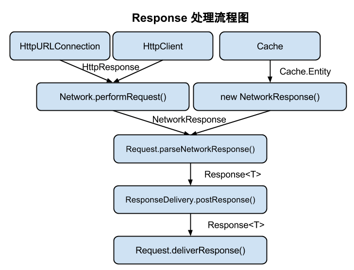

# Android-Volley-Demo
基于android volley库的demo，并附上volley源码和注释理解。

# 概要分析
- Response的解析流程：
 

  1、DiskBasedCache中缓存有该request，则用Cache.Entity在构造NetworkResponse对象。
   
  2、缓存中没有，则加入网络请求队列，BasicNetwork的performRequest()方法中会用HttpResponse构造NetworkResponse对象，而HttpResponse的获取具体实现方法有两种：HttpURLConnection（API >= 9）和HttpClient。
   
  3、NetworkResponse会被具体的Request解析为对应的Response<T>，比如StringRequest、JsonRequest、ImageRequest中都实现了自己的parseNetworkResponse()方法。
   
  4、得到Response<T>后，再由ResponseDelivery（具体实现类是ExecutorDelivery）.postResponse(request, response)来发送reponse。
   
  5、最后具体的Request会在deliverResponse()方法中收到消息，并在该方法中回掉Listener给具体调用者。
